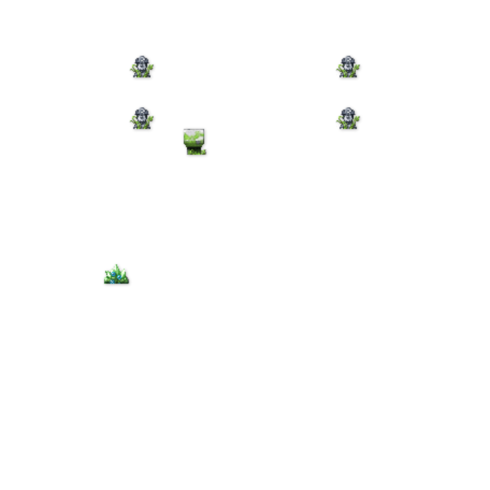
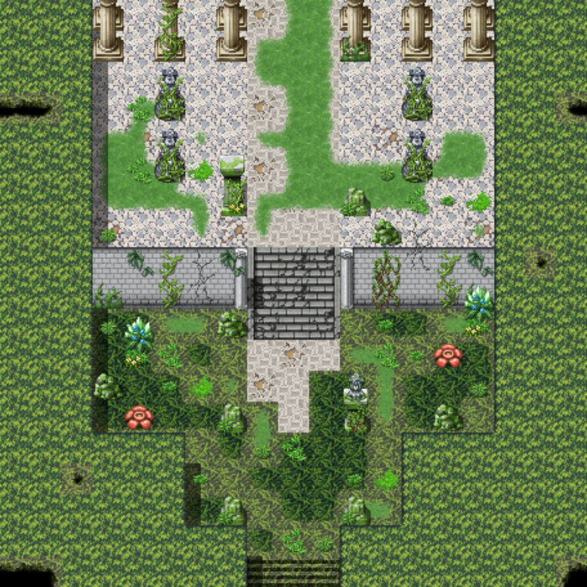
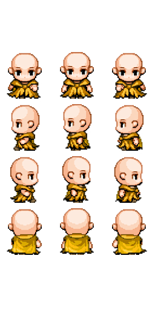

# Document of **Jorney-to-the-west** source code 

**Yang Daming 2018-9**

</br></br></br>
:shield: :shinto_shrine: :monkey_face: :video_game: :pig_nose::mountain::crossed_swords: 
</br></br></br>
- [Document of **Jorney-to-the-west** source code](#document-of-jorney-to-the-west-source-code)
    - [Game Walkthrough Video:](#game-walkthrough-video)
    - [Modules function :](#modules-function)
        - [:deciduous_tree: Map](#deciduoustree-map)
        - [💡 Event](#%F0%9F%92%A1-event)
        - [:monkey_face: Hero](#monkeyface-hero)
        - [:video_game: System](#videogame-system)

</br></br></br>
:shield: :shinto_shrine: :monkey_face: :video_game: :pig_nose::mountain::crossed_swords: 
</br></br></br>


## Game Walkthrough Video:

:movie_camera: 朱紫山 : [https://youtu.be/tyTOYC27A0A](https://youtu.be/tyTOYC27A0A) 

:movie_camera: 火焰山 : [https://youtu.be/1ok4zJkqKFY](https://youtu.be/1ok4zJkqKFY)

:movie_camera: 石室1 : [https://youtu.be/zdzxLfE5eOk](https://youtu.be/zdzxLfE5eOk)

:movie_camera: 石室2 : [https://youtu.be/P3tv8qAg6Zg](https://youtu.be/P3tv8qAg6Zg)


## Modules function :


### :deciduous_tree: Map 

Our script files for map module are [Map.js](src/MyGame/Map/Map.js) and [MapParser.js](src/MyGame/Map/MapParser.js) 

The main functionality of [Map.js](src/MyGame/Map/Map.js) is :

1. Read in JSON files describing the current map

The most inmportant functionalities of [MapParser.js](src/MyGame/Map/MapParser.js) are :

1. Parse the data in the JSON files
2. Render the map and NPC in that map
3. Detect events on certain map
4. Judge whether a pile in the map is walkable


Now, I am trying to explain how we make our map 2.5D via one of the JSON file affliated to each map.

The JSON file is called `*-dat.json` (\* represents for the map, like `wanggong-dat.json`), and it looks like : 

```json
{
  "width": 19,
  "height": 19,
  "data": [
    200, 200, 200, 200, 100, 200, 100, 200, 100, ... ...
  ],
  "content": {
    "10*": "walkable",
    "11*": "wevent",
    "20*": "unwalkable",
    "21*": "uevent",
    "*": "height"
  },
  "born": [9.5, 14.5]
}

```

The basic geometrical information of a map are all included in this file, like 'width', 'height', indicating 				  			  			 	this is a 19 piles by 19 piles map. And there are 19 * 19 values in the data array, corresponding to 19 * 19 	piles. The meanings of each value are written in key 'content'. To be more specific :

The hundreds digit represents for whether a pile is walkable or not, so when we parse the file and decide if our hero can walk on a certain pile, this digit can tell us the answer.

The tens digit indicates if this pile will trigger an event, both walkable and un-walkable piles can be  triggers for events.

And the units digit stands for the height of the pile. With this digit we can prevent hero from walking straight to a higher place from the ground (since both of the piles are walkable). We set certains rules for this digit:

1.  Piles of same units digit are connected
2.  Piles of ajacent units digit, like 1 and 2, or 2 and 3, are also connected
3.  Other scenarios are all divided.

So, we can set the units digits of ground piles with 1, stairs with 2, mountains with 3.

Finally, the key 'born' is the birth place of hero.


Another approach to make our map 2.5D is using the [Engine_LayerManager.js](src/Engine/Core/Engine_LayerManager.js) to draw a multi-layer map, like :

```javascript
    gEngine.LayerManager.addToLayer(gEngine.eLayer.eBackground, this.mMapBkg);

    var i;
    for (i = 0; i < this.mMyNPC.length; ++i)
       gEngine.LayerManager.addToLayer(gEngine.eLayer.eActors,this.mMyNPC[i].getNPC());

    gEngine.LayerManager.addToLayer(gEngine.eLayer.eActors, this.mMyHero.getHero());

    gEngine.LayerManager.addToLayer(gEngine.eLayer.eFront, this.mMapFrg);
```

And a sample foreground is image is like below (the background of this image is transparent) :

A sample Background is like below :



With this method, our hero can hide behind a pillar when he is at the back of the pillar, and can block it when he is at the front of it. 


### 💡 Event

I think this is the most interesting module in our game.

To realize events in maps we introduces one module and two types of JSON files:

**[Handler.js](src/MyGame/Events/Handler.js) / [zhuzishan-event-index.json](assets/map/zhuzishan/zhuzishan-event-index.json) / [zhuzishan-event.json](assets/map/zhuzishan/zhuzishan-event.json)**

(zhuzishan is just an instant, each map includes a event file and a event-index file)

In **Handler** there is only one method : `GameEvents.handle = function (e, game)` (GameEvents is class name), **e** is one of the value in event JSON file, this will be explained later.

This function will be called when certain piles are triggered. Based on current map, sequence number of the triggered pile,  **handle** will look into the two JSON files and figure out what is going on. After acknowledging  the type of event that has been triggered, **handle** will go through a **switch** function and will make some changes. The contents in **switch** are as below:

```javascript
 switch (e[1]) {

        case "Go":
        return function(game) {
            game.nextScene = getScene(e[2]);
            gEngine.GameLoop.stop();
            document.mEventMutex = false;
        }
        break;

        case "Show":
        ...
        break;

        case "Battle":
        ...
        
        ...
        
        default:
        return null;
    }
```

Now you can regard **e[1]** as a tag indicating the type of a event, and **e[2] e[3] ...** are attributes that fully explained the event. For example, if **e[1] == 'Go' ** , and **e[2]** should be the name of next scene. These are all stored in the two JSON files.

So, now I am going to show the structure of these two JSON files:

```json
{
    "986": "xiyijing",
    ...
    "1159": "go_zhuzishanjiao",
    "1160": "go_zhuzishanjiao",
    ...
}
```
**Key** in first file: serial number of special pile
**Value** in first file: event name

```json
{
    "xiyijing": [
    			["J",
					"Show",	[
						["zhuzishan-xiyijing", "蜥蜴精：什么人敢吵得大爷我没的清闲？！"],
						["sunwukong", "孙悟空：原来就是个蜥蜴成了精，不知道自己......"],
						["zhubajie", "猪八戒：大师兄等等我！"],
						["tangseng", "唐僧：悟空，切勿下杀手啊。"]
					]
				],
				[null,
					"Battle", ["zhuzishan", "zhuzishan-xiyijing"]
				],
				[null,
					"Win",
						[null,
							"Show", [
								...
							]
						]
					],
				[null,
					"Win",
						[null,
							"Get", ["golden_lotus"]
						]
				],
			false, 0],
	...
    
	"go_zhuzishanjiao": [[null,
				"Check", "Golden Lotus",
					[null, "Go", "zhuzishanjiao"],
					[null, "Show", [["tangseng", "且慢，金莲还未替那位小姑娘找到。"]]]
				],
			[null,
				"Check", "Golden Lotus",
				[null, "Go", "zhuzishanjiao"],
				[null, "Back"]
			],
			true, 0],
 	...
}
```

**Key** in second file: event name
**Value** in second file: handle array of an event


As you can see, we seperate certain pile from its event, making an event file easier to parse. It can also help us avoid problems like triggering an event for several times (There will be an example).

Now, please recall the **handle** module, and you can see now we use a handle array to describe an event, like **"go_zhuzishanjiao"** in the above :

```json
"go_zhuzishanjiao": [[null,
				"Check", "Golden Lotus",
					[null, "Go", "zhuzishanjiao"],
					[null, "Show", [["tangseng", "且慢，金莲还未替那位小姑娘找到。"]]]
				],
			[null,
				"Check", "Golden Lotus",
				[null, "Go", "zhuzishanjiao"],
				[null, "Back"]
			],
			true, 0]
```

There are four kinds of handles in this event, "Check", "Go", "Show", and "Back". Each handle has a special designed format like : `[null / 'J', handle_name, **handle_attributes]` . The first parameter, with value null or 'J', tells us whether we have to interact with the pile to trigger the event. We have to press 'J' to talk with an NPC, but we will automatically run into a fight or a scene in main plot. The second parameter, the name of the handle, can help the game go back to **[Handler.js](src/MyGame/Events/Handler.js)** and know what to do next. For example, this is handle **"Show"** in **[Handler.js](src/MyGame/Events/Handler.js)** (recall **e[1]** == "Show" here, and now you understand **e** is what we read from the JSON file above) :

```json
case "Show":
return function(game) {
    var i;
    for (i = 0; i < e[2].length; ++i)
        document.mMsgQueue.push(e[2][i]);
}
break;
```

The game will then find **e[2]**, in `[null, "Show", [["tangseng", "且慢，金莲还未替那位小姑娘找到。"]]]` is 

`[["tangseng", "且慢，金莲还未替那位小姑娘找到。"]]` . And the engine will then put this message array(normally there will be more than one message. In this example, unfortunately, there is only one lol) onto the screen with `document.mMsgQueue.push(e[2][i])`, a method in our dialogue system.

And the last two parmeters indicate if the event can happen for mutiple times.

Finally, I want to describe a special case that may cause some problems if we don't seperate the handle array from the number of a pile.

Imagine there is a monster, and when you step into the eight piles arount it you will automatically be dragged into a fight. If we use pair like **"12": [null, "Fight" ...] , "13": [null, "Fight" ...]** , though each pile can trigger the event for only one time, "Fight" in each pile are independent. Players may have to fight a monster for many times before he can proceed his adventure, which is clearly a bug. So, we kind of turn the event into a singlton. With this technique, we can prevent such bug from happenning.


### :monkey_face: Hero

Hero module briefly relates to two parts: The first part is about basic setting of a hero (his movements and status), and the second part is about his skills in the combat.


To begin with, how we draw our heros? Though we have learnt how do make a hero move at class (with sprite sheets it can be easily done), in order to make this work more efficient, we again use a JSON file to store a hero's movement, it may seems like this :

```json
{
    "width": 256,
    "height": 512,
    "Down": {
        "Stand": [[99, 163], [155, 86]],
        "Walk": [
            [[11, 163], [69, 87]],
            [[185, 163], [243, 87]]
        ]
    },
    "Left": {
        "Stand": [[104, 249], [152, 172]],
        "Walk": [
            [[18, 249], [66, 173]],
            [[190, 249], [237, 173]]
        ]
    },
    ... ...
}
```

And the sprite sheet related to this JSON file is :



Since we have three heros and many NPCs, hardcode method is obviously not practical, and use JSON files to standarlize such work is quite necessary.


Similarly, heros' attributes, like original skills and HP / VP are also stored in a JSON file called [character_info.json](./assets/hero/character_info.json). 


Finally, about the combat in our game, we introduce three modules [Combat.js](src/MyGame/Combat/Combat.js) , [Action.js](src/MyGame/Combat/Action.js)and [HPBar.js](src/MyGame/Combat/HPBar.js) . **Combat** is the core module in combat scene, it contains methods that make changes to heros' and enemies' status, so that a combat can then actually happen. It also includes a special equation to calculate damage, named `function _damageFoumula(attack, defense)`. With this method the damage is no longer static (but will not be too exaggerated). **Action** is a module manipulated by **Combat**, it simply contains the animation of heros in combat scene, which is quite primitive by now. **HPBar** module is another module that does drawing on the canvas, it will sychronize the HP / VP Bar with heros' status in the combat.


### :video_game: System

We have the following system in our games :

- **Combat system** : a new scene
- **Weapon system** : a viewport, you can see the equipped weapons and armours of each heros, and can check the status, (including HP/VP/defense...) of each heros.
- **Items system** : a viewport, you can use potions, or equip heros with armours and weapons.
- **Dialogue system** : a css window, show dialogue
- **Status system** : a viewport, you can see heros HP and VP here. It can also be shown in **Combat** so that players can be aware of each heros status in time.
- **Map system** : two maps, one in the up right corner which will not block players' sights, another can be shown in the middle of your screen, which is useful for player to stop and check.

Each system is a viewport(deleting two lines 217, 220 from [Camera.js](./src/Engine/Cameras/Camera.js) and setting alpha to 0 can make the background of the viewport transparent) or window(written in css), so that systems like dialogue, status, mao, weapon and potion like look like a menu bar.

With all these systems, we believe we have made our game a prototype of an RPG game.

